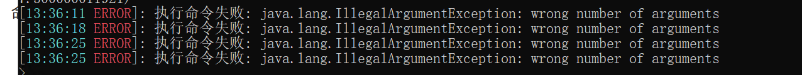

# 定义

- `主程序`: 指启动 EasyBot.exe 的电脑
- `服务器`: 指运行`我的世界`服务器的电脑
- `机器人`: 指`社交平台`的服务，如: "LLOnebot"

# 服务端的报错

## java.net.ConnectException: Connection refused: no further information

```log
[09:36:55 WARN]: [EasyBot] 正在尝试重连服务器
[09:36:55 INFO]: [EasyBot] 正在连接到服务器: ws://127.0.0.1:26990/bridge
[09:36:55 ERROR]: [EasyBot] 连接遇到错误: java.net.ConnectException: Connection refused: no further information
```
### 原因

1. 首先，检查主程序是否已经启动，并且端口是否正确。
2. 如果你的服务器和主程序不在一台电脑，请阅读[本篇内容](双机问题.md)

# 主程序报错

## 由于目标计算机积极拒绝，无法连接

```log
连接失败: Websocket.Client.Exceptions.WebsocketException: Failed to start Websocket client , error: 'Unable to connect to the remote server'
 ---> System.Net.WebSockets.WebSocketException (0x80004005): Unable to connect to the remote server
 ---> System.Net.Http.HttpRequestException: 由于目标计算机积极拒绝，无法连接。 (127.0.0.1:2210)
 ---> System.Net.Sockets.SocketException (10061): 由于目标计算机积极拒绝，无法连接。
...
```

### 原因

无法连接上`机器人`导致的

- 你的配置有问题 [请详细阅读本片文档](/quick_start/robots/LLOneBot)
- 检查机器人是否启动
- 如果你使用LLOnebot,出现这种情况请尝试重启QQ,这是BUG且不是EasyBot导致的

# 执行命令失败 或 Can not find runCommand method



请看[本篇文档](命令无法执行.md)

# 我的QQ老掉线怎么办

1. 首先，官方对于野生机器人管控十分甚至九分严
2. 如果你正在使用LLOnebot,请将QQ降级到旧版本(越老越好) 因为新版本QQ加了检测
可尝试老版本QQ 27597
> Windows x64: https://dldir1.qq.com/qqfile/qq/QQNT/b07cb1a5/QQ9.9.15.27597_x64.exe
3. 最终解决办法: 收购腾讯