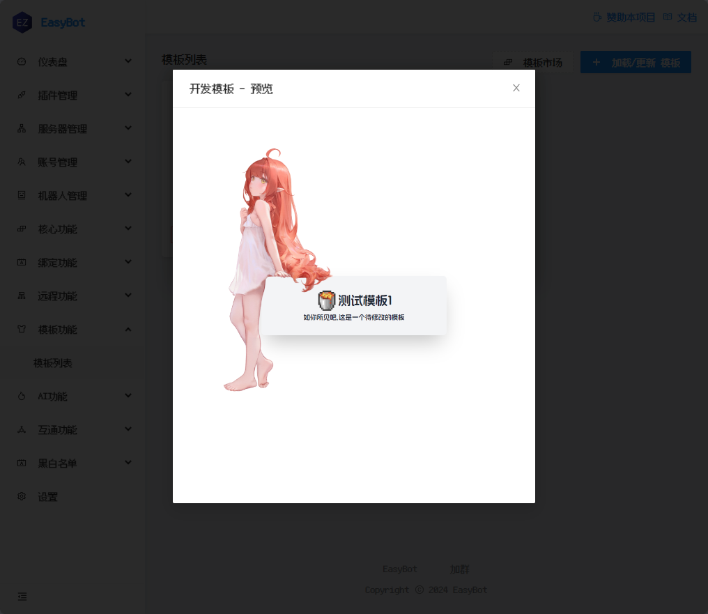
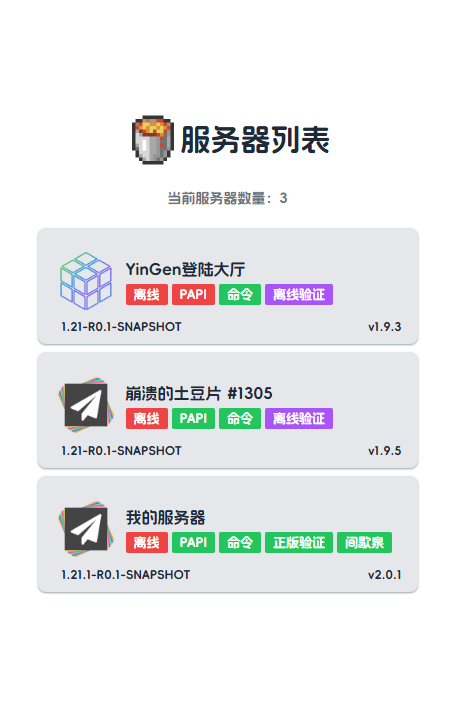
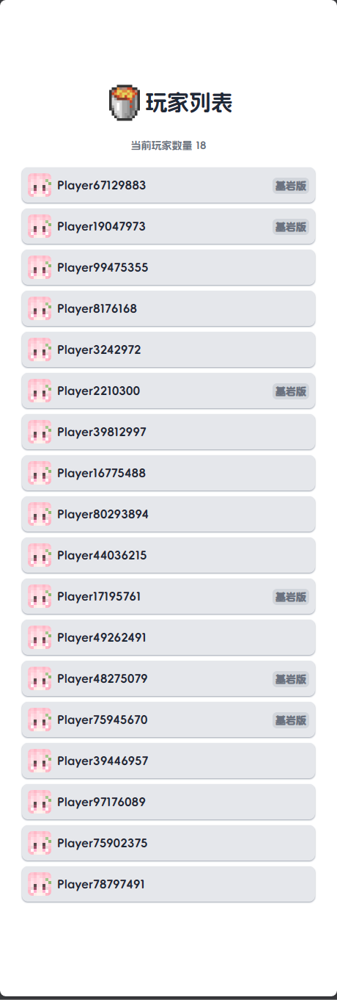

<ImageTemplate
    style="margin-top:15px;"
    :templateInfo="template"
    :propsData="template.props"
    :hideContent="true"
/>

# 简洁模板套装

## 注意

此模板需要`EasyBot v1.3.3`以上的版本,不可在旧版本 EasyBot 上运行！

## 模板列表

## 模板一号

## 服务器列表模板

## 玩家列表模板

