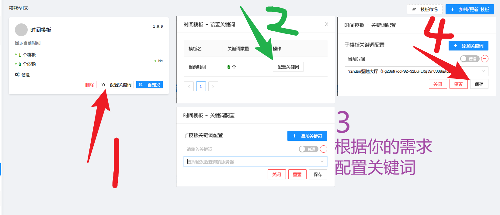
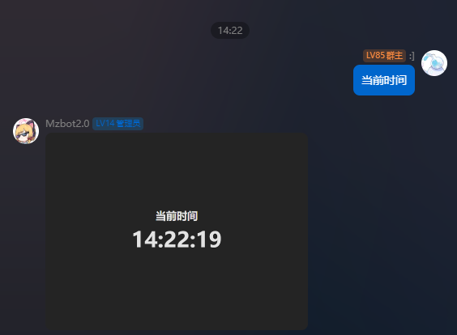

# 图片模板

## 概念

> [!TIP] 概念
> - 图片模板是EasyBot图片渲染的高级模板，可以渲染出各种复杂的图片。   
> - 模板渲染基于浏览器，理论上任何你可以使用任何熟悉的前端框架进行模板开发
> - [开发教程](/template/index)

## 安装模板

1. 从[模板库](/market/index)下载模板安装包
2. 打开EasyBot的模板管理界面
3. 点击右上角添加,将模板拖入即可

## 配置关键词

