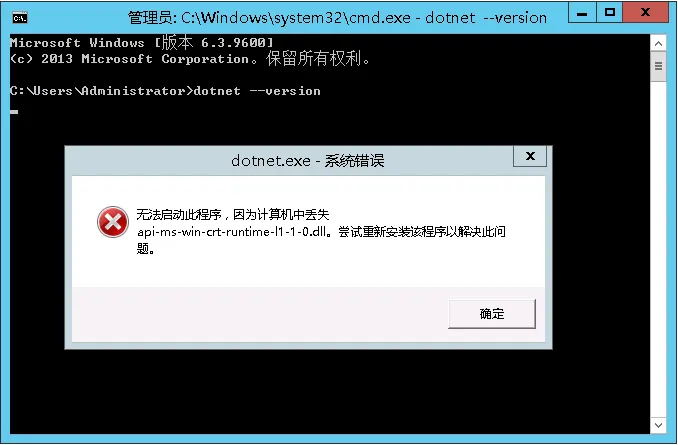
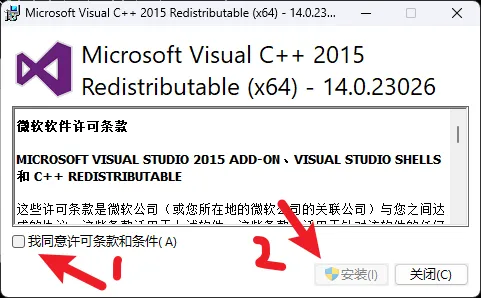
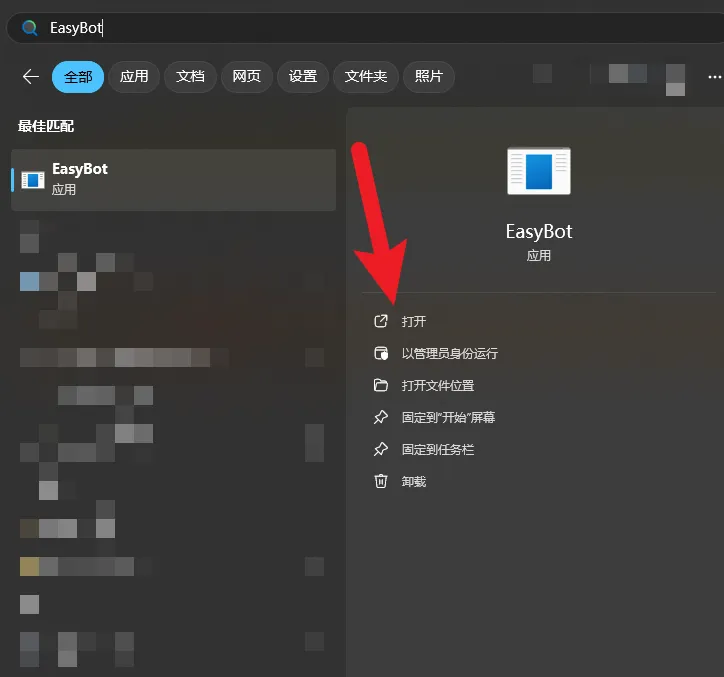
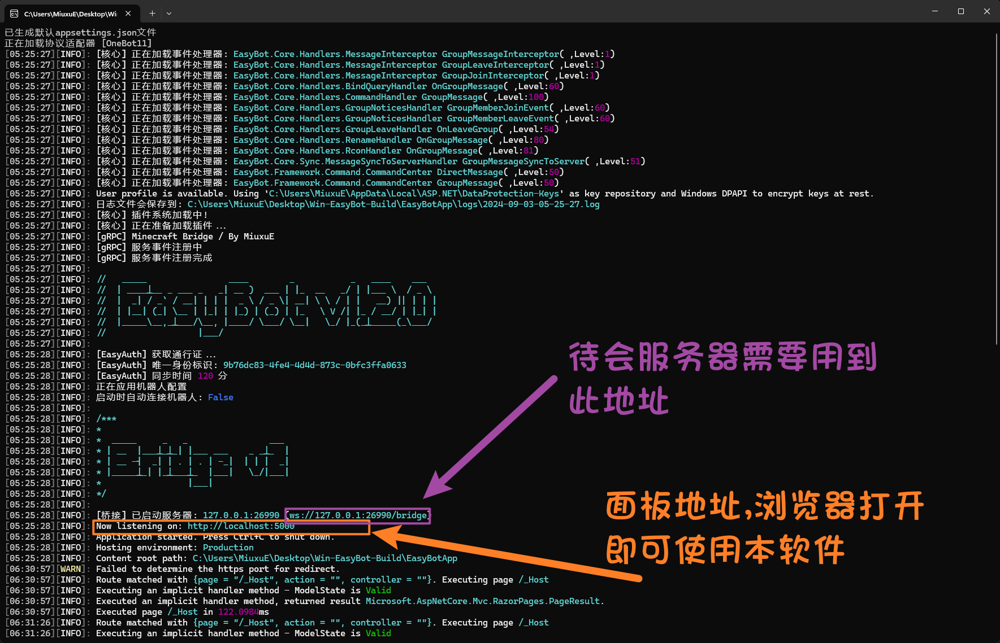
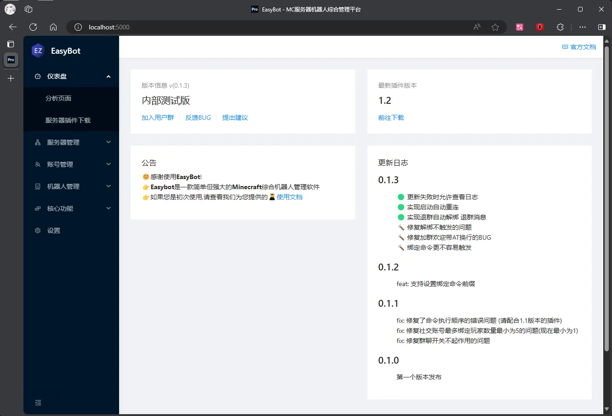

# 安装 EasyBot 主程序

### 第一步: 安装运行环境

> [!TIP]
> EasyBot 依赖:NET8Web 运行时，在启动软件前，你必须要安装运行环境

🔥 先下载我 👉 [Download .NET 8.0 Runtime (v8.0.4) - Windows x64 Installer](https://dotnet.microsoft.com/en-us/download/dotnet/thank-you/runtime-8.0.4-windows-x64-installer)

🔥 后下载我 👉 [Download ASP.NET Core 8.0 Runtime (v8.0.4) - Windows x64 Installer](https://dotnet.microsoft.com/en-us/download/dotnet/thank-you/runtime-aspnetcore-8.0.4-windows-x64-installer)

> [!TIP]
> 上面这俩都要装，从第一个.NET8.0Runtime 开始装
> 安装程序是中文的，一路下一步即可安装完毕，提示安装成功则第一步完成

### 注意

> [!IMPORTANT] 旧版系统兼容问题
> 如果你是服务器操作系统，且系统不是 2019 以上(比如: 2016 2012R2 之类的)，那么安装好我们的 ASP.NET Core 运行时之后可能你还需要额外安装一个运行环境
> {.is-important}

##### 如果你的服务器版本过旧，运行程序时可能会报类似的错误

#### 解决方法

解决方法非常简单，安装 VC++ 运行环境即可解决
点我下载: https://www.microsoft.com/zh-cn/download/confirmation.aspx?id=48145

# 第二步: 安装 EasyBot 主程序

> [!TIP]
> 如果你是小白，请选择 安装包下载
> 非安装包节点下载后是 .zip 格式的文件，此时就需要自行解压!

如果你已经安装好了运行环境，那么可以来到激动人心的安装 EasyBot 主程序部分!前往找到 EasyBot 的最新版本，选择任意一个节点下载我们的主程序，之后一路下一步即可完成安装

> 还是那句话: 安装程序是中文的，一路下一步即可安装完毕，提示安装成功就好了！

安装好后按下 Win 键 搜索 EasyBot 即可打开程序

至此你已经成功的完成了主程序的安装
{.is-success}
