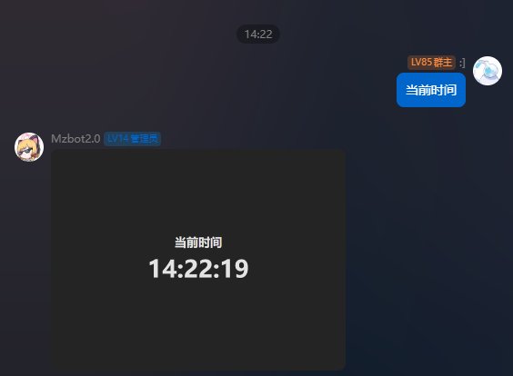

# 使用VITE+REACT创建项目

> [!TIP] 温馨提醒
> 本教程对没有接触过前端开发的同学不友好

本教程,我们要实现一个获取时间的卡片


## 安装NodeJS

[NodeJS下载地址](https://nodejs.org/zh-cn/download/prebuilt-installer)

## 设置国内源

由于<del>`懂的都懂`</del>的原因,如果你运行npm卡住了,可以设置国内源
```bash
npm config set registry https://registry.npmmirror.com/
```

## 创建项目

```bash
npm create vite@latest
```

1. 在交互式模式中输入项目名字
2. 在`Select a framework`时选择`React`
2. 在`Select a variant`时选择适合你的语言,本教程使用`TypeScript`

```bash
npm create vite@latest
Need to install the following packages:
create-vite@6.1.1
Ok to proceed? (y) y
√ Project name: ... vite-project
√ Select a framework: » React
√ Select a variant: » TypeScript

Scaffolding project in D:\Codes\Nodejs\vite-project...

Done. Now run:

  cd vite-project
  npm install
  npm run dev
```

进入你的项目目录,使用`npm install`安装所有依赖

## 使用相对路径

在你的模板被加载好后,EasyBot会代理路径,如果使用默认的`/`作为路径,Vite将会访问EasyBot项目的路径,因此 你需要将vite.config.ts中的base改为`./`

```ts
import { defineConfig } from 'vite'
import react from '@vitejs/plugin-react'

export default defineConfig({
  base: './', // 添加这一行
  plugins: [react()],
})
```


## 安装SDK

使用以下命令安装SDK

```bash
npm install easybot-image-sdk
```

## 创建申明文件

如果你成功完成了上面的操作,你的目录结构应该是这样的


我们现在需要创建一个声明文件,打开`public` 并在目录下创建一个`manifest.json`文件,并写入以下内容

```json
{
    "name": "我的第一个模板",
    "description": "这是我的第一个模板",
    "id": "my_first_template",
    "author": [
        "Me"
    ],
    "version": "1.0.0",
    "icon": "/assets/icon.png",
    "dependencies": [],
    "tag": [
        "信息"
    ],
    "settings": {
        "allow": false
    },
    "template": [
        {
            "key": "time",
            "name": "当前时间",
            "path": "index.html",
            "settings": {
                "allow": false
            },
            "no_server": true
        }
    ]
}
```

## 编写逻辑

根据`manifest.json`中的配置,我们要实现一个时间的卡片

### App.tsx

```tsx
import './App.css'
function App() {
  return (
    <div className='container'>
      <div className='clock'>
        <p className='title'>当前时间</p>
        <p className='time'>{new Date().toLocaleString(undefined, {
          hour: '2-digit',
          minute: '2-digit',
          second: '2-digit',
        } as Intl.DateTimeFormatOptions)}</p>
      </div>
    </div>
  )
}

export default App
```

### App.css

```css
.container {
  height: 100vh;
  width: 100vw;

  display: flex;
  flex-direction: column;
  justify-content: center;
  align-items: center;
}

.time {
  font-size: 4rem;
  font-weight: bold;
  margin: 0;
}

.title {
  text-align: center;
  font-size: 2rem;
  margin: 0;
  font-weight: bold;
}
```

## 打包

运行npm run build进行打包

```bash
npm run build
```


打包的结果在`dist`目录下,你需要进入目录,全选文件,然后右键压缩成zip文件


## 在EasyBot加载本模板

确认一切无误后,打开EasyBot的模板管理页面,将打包好的zip文件上传即可


## 配置关键词

关键词是EasyBot识别模板的关键,你可以在模板管理页面中配置关键词,当用户在群聊内发送对应消息时,模板会触发


## 测试

