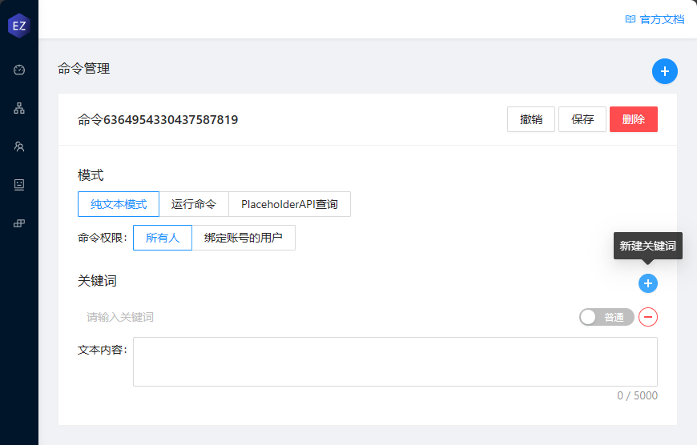
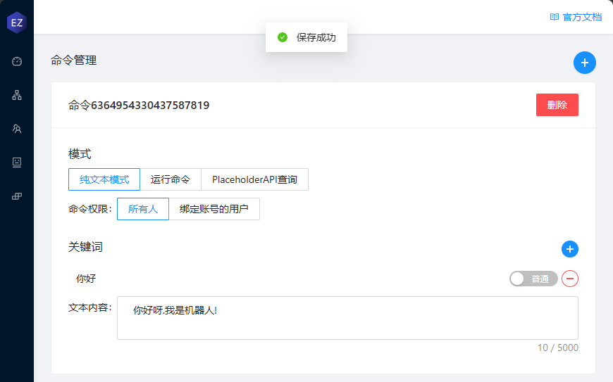
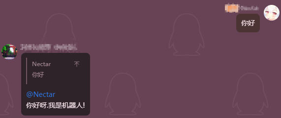
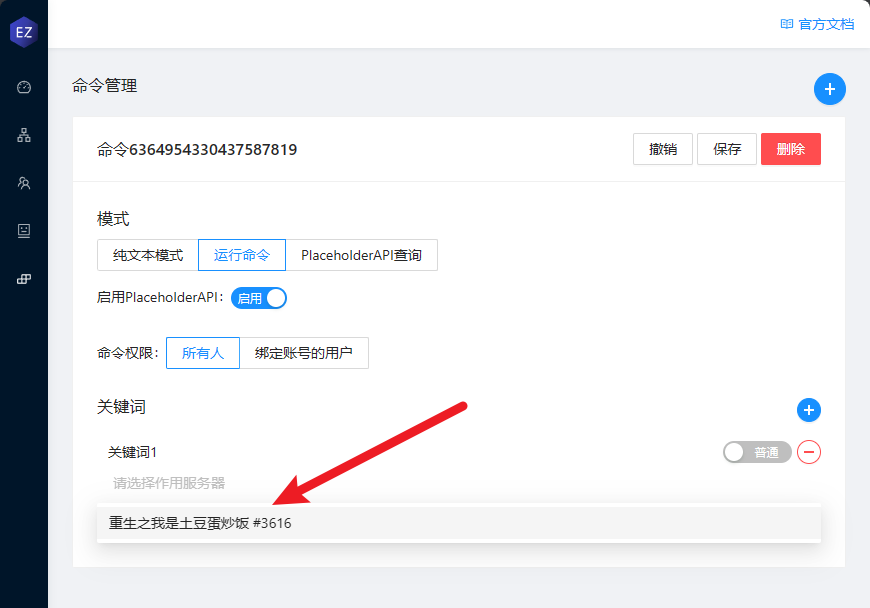
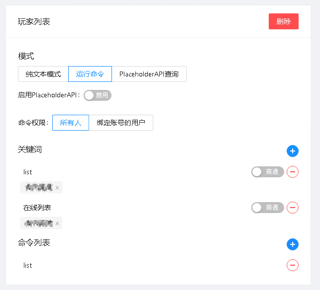
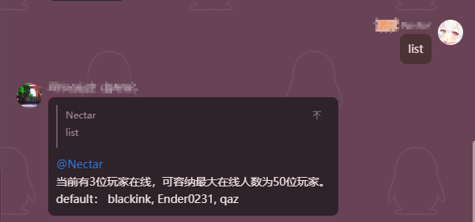
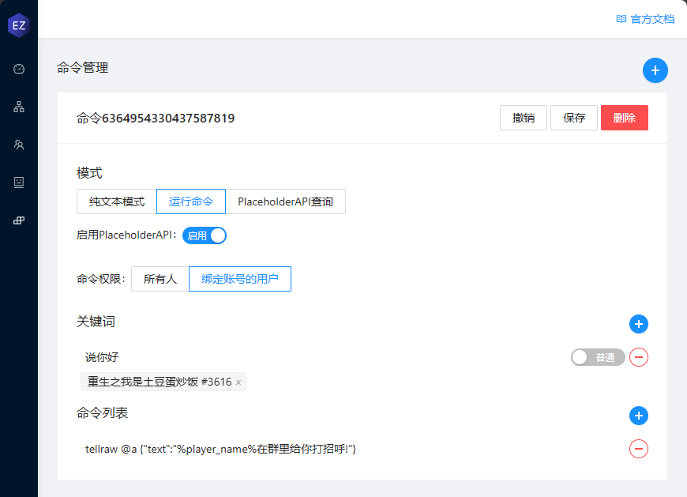
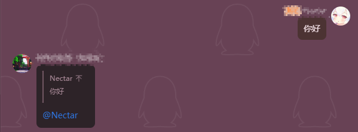
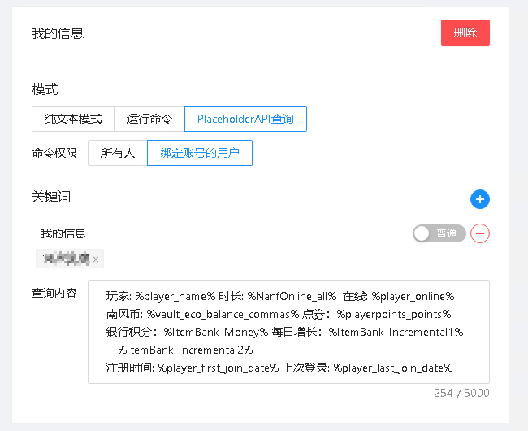
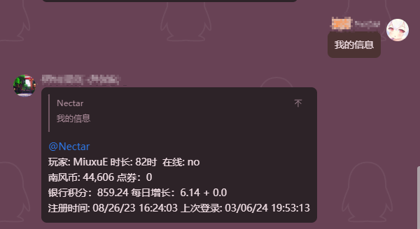

# 命令列表

## 纯文本模式

纯文本模式可以在用户触发关键词后回复指定文本

## 运行命令

> [!IMPORTANT] 注意
> 旧版本服务端需要启用`RCON`才能够使用`命令执行`功能!  
> 无所谓你 Rcon 什么密码，什么端口，只要求`enable-rcon: true`

### 关键词中的作用服务器

作用服务器表示触发这个关键词后 在哪些服务器运行此命令

一个关键词可以有多个作用服务器， 如果设置多个作用服务器， 触发后会从上到下执行并获取多个返回结果

#### 一些例子

#### 启用 PlaceholderAPI

只有命令权限是绑定账号的用户 才可以使用指定玩家的 PlaceholderAPI 占位符

启用 PlaceholderAPI 后可以在命令中插入 PlaceholderAPI 的占位符

比如你可以创建一个"打招呼"命令 并且启用 PlaceholderAPI

## PlaceholderAPI 查询

嘛.. 顾名思义嘛

只有命令权限是绑定账号的用户 才可以使用指定玩家的 PlaceholderAPI 占位符

