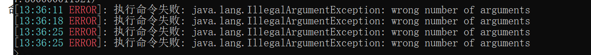

> [!INFO] 本教程适用于以下情况
> - 不管我执行什么命令，都返回"执行成功"
> - 执行命令报错
>   
> - 报错: `Can not find runCommand method`

# 完美解决方案

目前完美的解决方案,是使用远程RCON来作为命令执行者

1. 安装`≥1.9.0`的EasyBot服务器插件
2. 配置`config.yml`的`native_rcon`部分
```yaml
adapter:
  native_rcon:
    use_native_rcon: false
    address: "127.0.0.1"
    port: 25575
    password: "" # 服务端的RCON密码
```

## 在服务器启用RCON
1. 在服务器的`server.properties`中,将`enable-rcon`设置为`true`
2. 将`rcon.password`设置为你想要的密码,注意: 必须设置密码
3. 重启服务器


# 装有CMI的服务器注意了

CMI为了安全考虑,拦截了所有RCON命令执行 请参考本文档: [支持 CMI](/cmi.md)