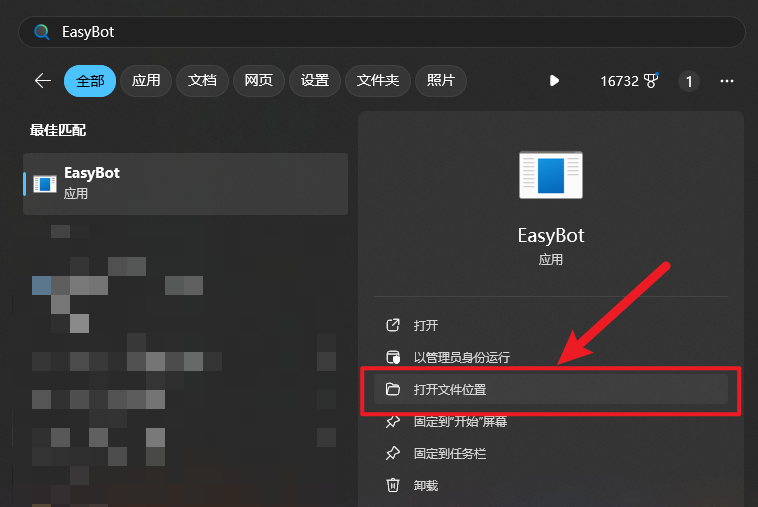
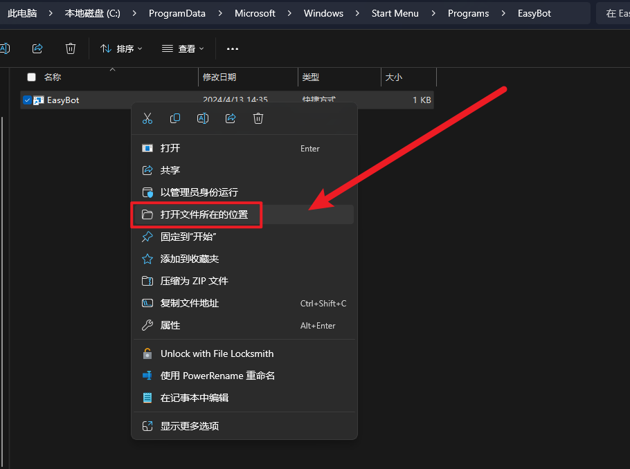
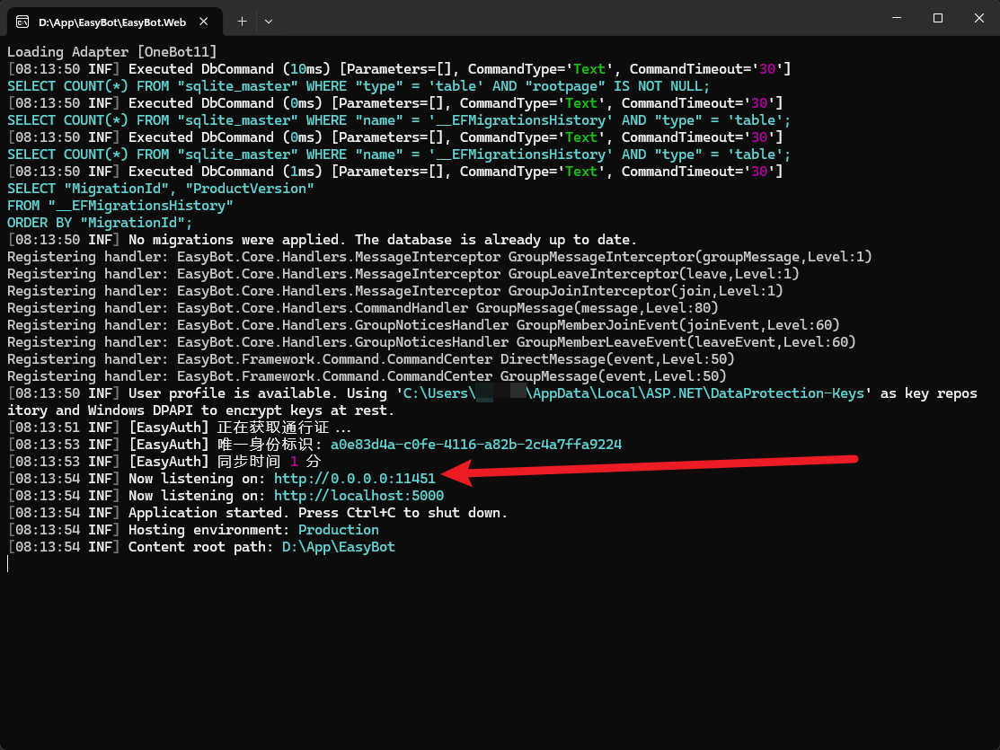
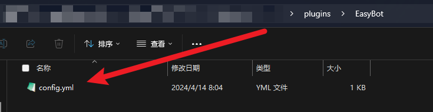
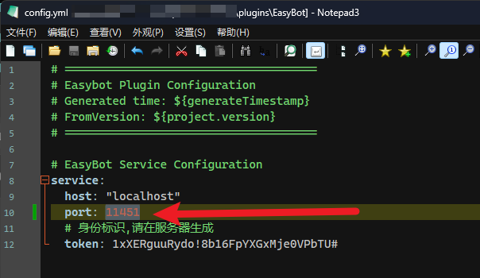
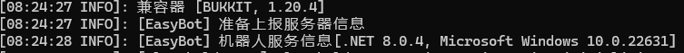
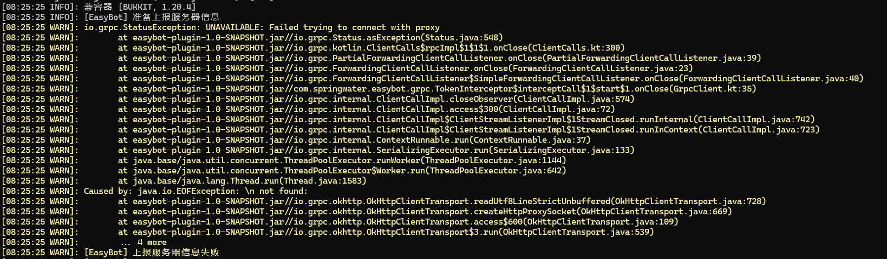
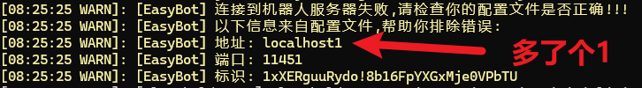

# 修改主程序端口
## 步骤

1. 找到EasyBot安装路径
2. 修改appsettings.json
3. 修改服务器中的配置

## 1.找到EasyBot安装路径

#### 通过安装包安装的

1. 按下Win键后搜索"EasyBot"
2. 点击"打开文件位置"
3. 找到快捷方式后右键+打开文件所在位置



## 2.修改appsettings.json

打开appsettings.json这个文件,修改Kestrel中grpc的Url字段

```
"Kestrel": {
  "Endpoints": {
    "web_app": {
      "Url": "http://localhost:5000",
      "Protocols": "Http1"
    },
    "grpc": {
      "Url": "http://0.0.0.0:5001",
      "Protocols": "Http2"
    }
  }
}
```
不了解Grpc的话就请不要修改Protocols中的Http版本

WebApp是你在浏览器打开的界面地址

Grpc是与服务器通信的桥梁

### 修改后

```
"Kestrel": {
  "Endpoints": {
    "web_app": {
      "Url": "http://localhost:5000",
      "Protocols": "Http1"
    },
    "grpc": {
      "Url": "http://0.0.0.0:11451",
      "Protocols": "Http2"
    }
  }
}
```


## 3.修改服务器配置

1. 打开服务器中的配置文件
2. 修改service.host和port
3. 启动验证

### 1.打开服务器中的配置文件



### 2.修改service.host和port



## 3.启动验证

## ✅ 成功



### ❌ 失败

⚠ 如果出现一堆黄色报错,比如提示 Failed trying to connect with proxy 则可能是地址或端口错误





