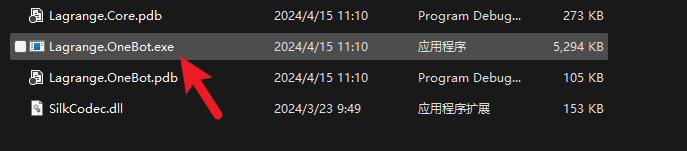
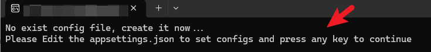
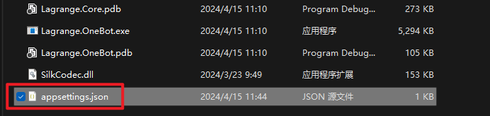
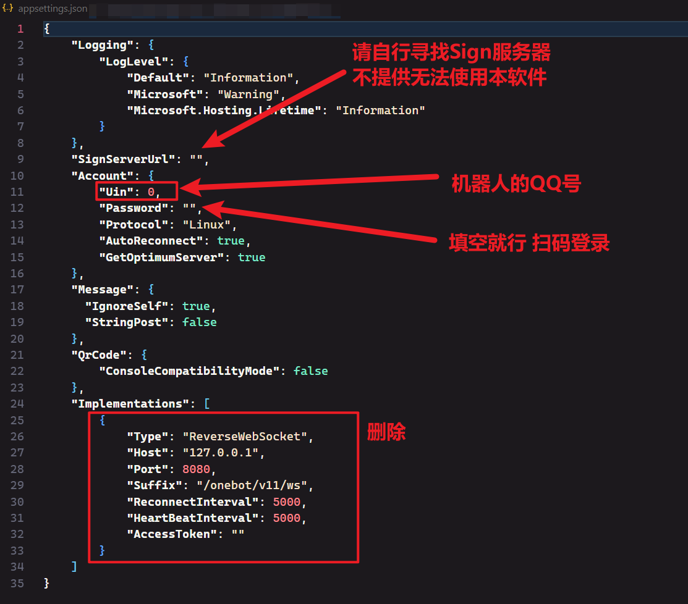
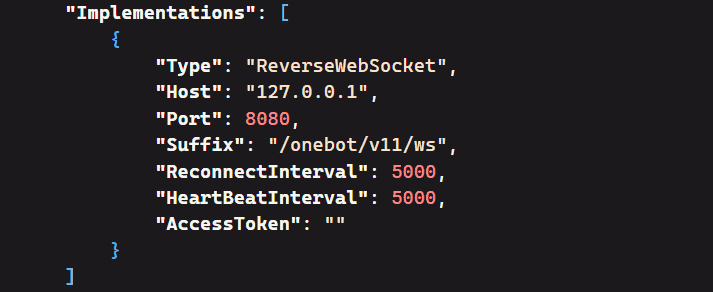
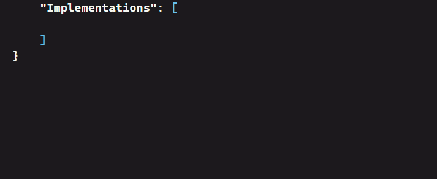
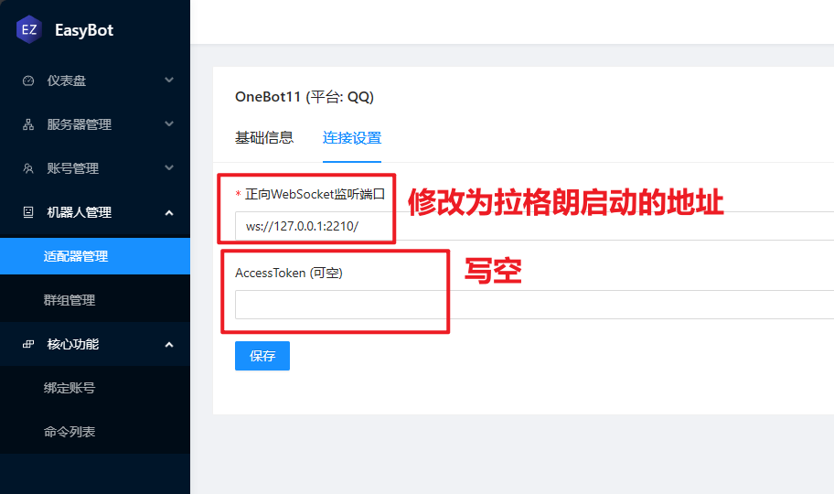
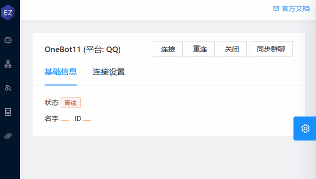

# 兼容器连接到Lagrange
1. 下载或编译拉格朗
2. 启动然后修改配置文件
3. 在主程序修改配置文件
> [!CAUTION]
> 请注意我们并不推你使用你使用拉格朗,如不别请尽量尽，请尽量不使用


使用拉格朗需要Sign服务器,请自行寻找。我们不提供Sign服务器！！

# 1.下载或编译拉格朗

## 下载:

如果你不会自己编译.net项目,可以前往拉格朗的发布地址直接下载发布版本:

<https://github.com/KonataDev/Lagrange.Core/releases>## 编译

请在编译前安装以下工具:

* git
* dotnet-sdk-8.0 或 dotnet-sdk-7.0
### 1.克隆仓库

```
git clone https://github.com/KonataDev/Lagrange.Core.git
```
### 2.打开目录

```
cd Lagrange.OneBot
```
## 3.使用命令编译

```
dotnet publish -r win-x64 -c Release -f net8.0 #使用.net8.0生成
```

```
dotnet publish -r win-x64 -c Release -f net7.0 #使用.net7.0生成
```
任选一即可,前提是你要有对应版本的SDK

# 2.启动然后修改配置文件

#### 先启动 Lagrange.OneBot.exe





#### 生成后在程序目录找到配置文件



### 修改配置文件

打开生成的配置文件,应该可以看到如下内容,请根据图片修改



#### 配置Implementations

现在我们删除Implementations原来的字段



添加如下字段:

```
{
  "Type": "ForwardWebSocket",
  "Host": "127.0.0.1",
  "Port": 2210,
  "HeartBeatInterval": 5000 ,
  "HeartBeatEnable": false,
  "AccessToken": null
}
```


复制后保存文件

### 启动拉格朗并登录账号


出现:

# 3.在主程序修改配置文件

1. 进入机器人管理 -> 适配器管理
2. 修改将AccessToken修改为空 且 修改地址



## 保存后连接



# OK

至此.你已完成拉格朗的配置且让主程序正确连接到拉格朗。

