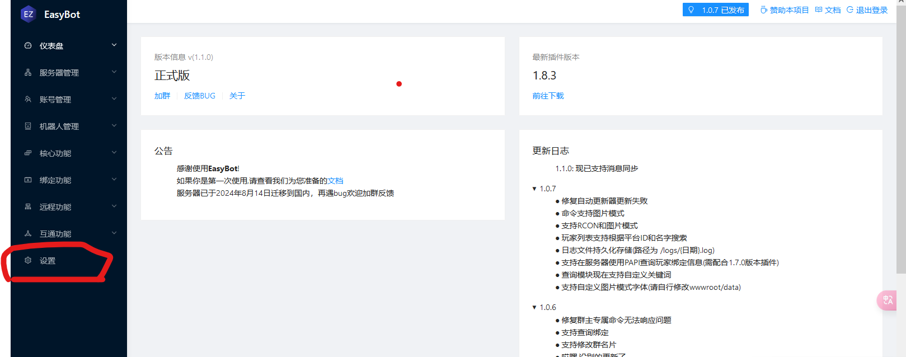
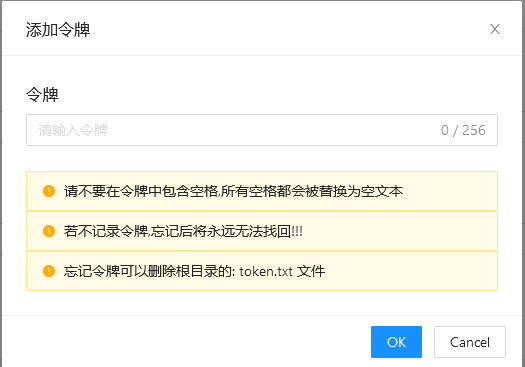
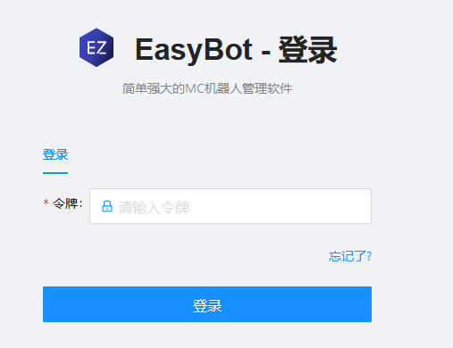

# 令牌登录

**前言:大部分人的 EsayBot 都是部署在云端服务器上，这就导致后台面板随时有可能会被他人访问**

## 设置方法

#### 1.登录 EasyBot 后台面板

#### 2.点击侧边栏的设置

#### 3.点击下边的添加认证器，并添加密码

> [!IMPORTANT]
> !!!请不要在令牌中包含空格，所有空格都会被替换为空文本!!!
> !!!若不记录令牌，忘记后将永远无法找回!!!
> !!!忘记令牌可以删除根目录的: token.txt 文件!!!
> {.is-warning}

#### 5.密码设置完成后网页将重新连接等待

接下来你就会来到一个新的页面

输入你的密码并登录，即可正常进入后台

> [!IMPORTANT]
> 注意，一旦忘记密码，请删除安装目录下的 Token.txt 文件
