# 消息同步

必要条件
> [!IMPORTANT]
> 软件版本≥1.1.0
> 插件版本≥1.8.0

## 第一步: 主程序配置

在主程序的左侧点击 "互通功能" -> "群服互通"

选择你的服务器

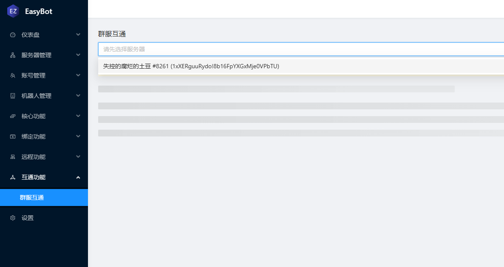

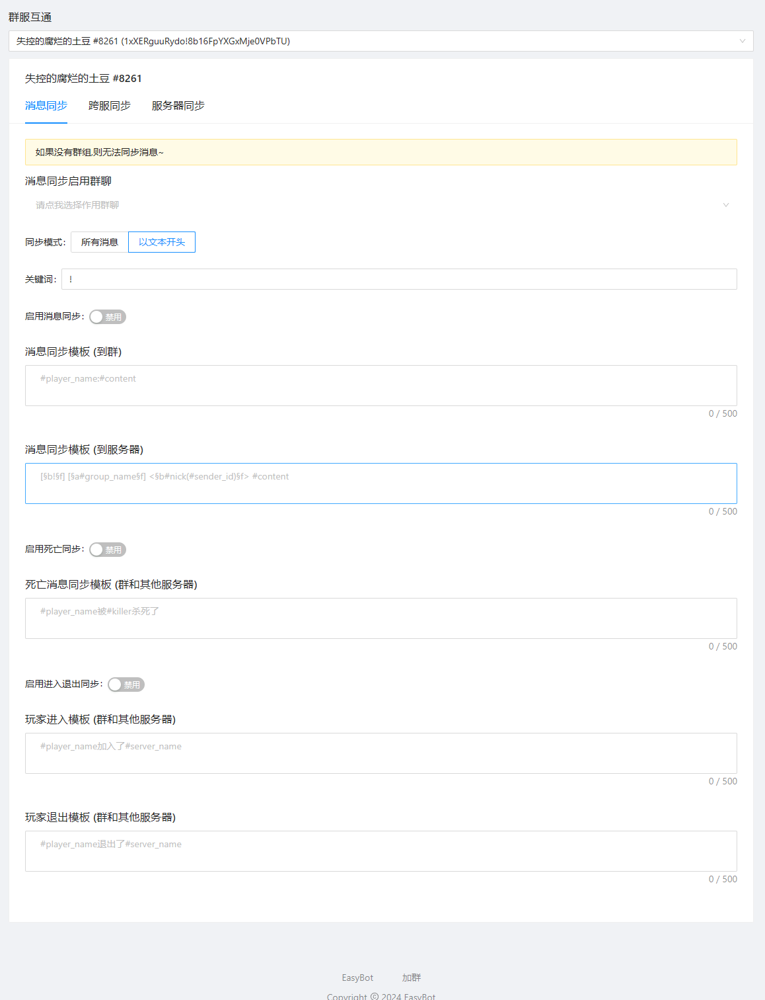

## 配置详解

### 消息同步

消息同步主设置

#### 消息同步群聊

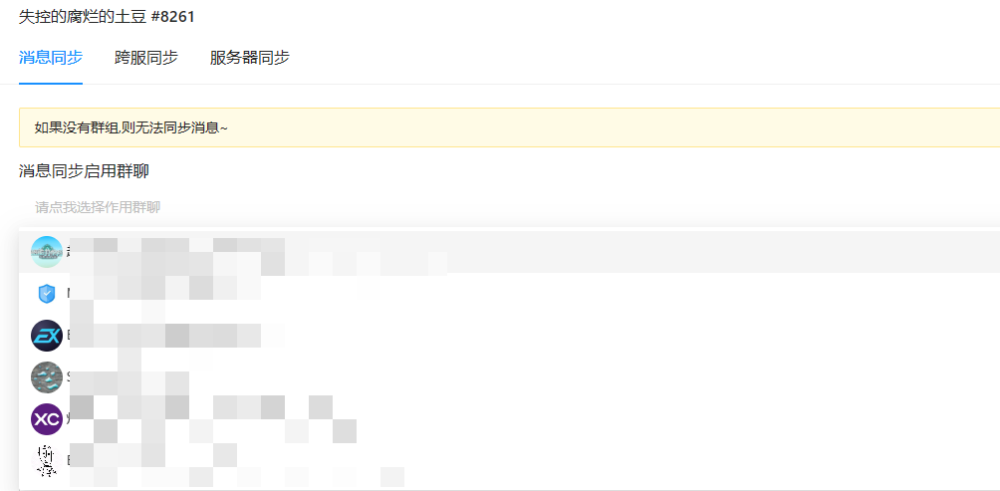

要启用消息同步的群聊,可设置多个群

设置后效果:

 - 服务器消息可以设置同步到该群

 - 该群消息可以设置同步到服务器

---

#### 同步模式&关键词

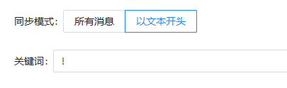

所有消息 (设置的群聊中所有消息都会被同步到你设置的服务器) (不包括机器人的消息)

以文本开头 (群聊中的消息必须以设定的关键词开头才会同步) (不包括机器人的消息)

---

#### 启用消息同步 (开关)

启用后以上选项才会生效,不启用就不会同步消息

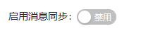

---

#### 其他选项

顾名思义嘛...

关于 "到服务器" "群和其他服务器"的区别:

到服务器是指 到服务器(((

群和其他服务器指的是 编辑的文本会被当作发送到群和其他服务器的模板

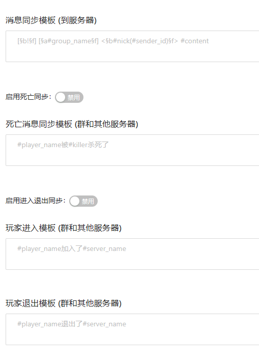

#### 模板的可用参数

在模板框中输入符号"#"来显示可用参数(添加的时候必须有"#"号)

小提示:image(图片地址)如果要使用本地文件，请填写此文件的绝对路径比如"C:\Users\MiuxuE\Pictures\uiltx15is5c.jpg

##### 信息同步模板到群
> 1.#player\_name显示发送玩家的名称

> 2.#player\_name\_raw显示发送玩家的名称(元数据) 和#player\_name没啥区别

> 3.#player\_uuid显示发送玩家的uuid

> 4.#server\_name玩家发送时所在的服务器名称

> 5.#player\_avatar玩家头像图片

> 6.#content显示玩家所发送信息

> 7.#image(地址)在信息中显示一张图片(此参数的地址指的是在线url或本地文件)

##### 消息同步模板 (到服务器)

> 1.#sender\_id发送者的ID

> 2.#group\_id信息来源的群号

> 3.#result当前命令的结果

> 4.#nick发送者的名称

> 5.#content发送的信息

> 6.#group\_name发送者所在的群名

##### 死亡消息同步模板 (群和其他服务器)

> 1.#player\_name显示发送玩家的名称

> 2.#player\_name\_raw显示发送玩家的名称(元数据) 和#player\_name没啥区别

> 3.#player\_uuid显示发送玩家的uuid

> 4.#server\_name玩家发送时所在的服务器名称

> 5.#player\_avatar玩家头像图片

> 6.#image(地址)在信息中显示一张图片(此参数的地址指的是在线url或本地文件)

> 7.#raw显示死亡的原始信息

> 8.#killer显示杀手

##### 玩家进入模板 (群和其他服务器)和玩家退出模板 (群和其他服务器)

> 1.#player\_name显示发送玩家的名称

> 2.#player\_name\_raw显示发送玩家的名称(元数据) 和#player\_name没啥区别

> 3.#player\_uuid显示发送玩家的uuid

> 4.#server\_name玩家发送时所在的服务器名称

> 5.#player\_avatar玩家头像图片

> 6.#image(地址)在信息中显示一张图片(此参数的地址指的是在线url或本地文件)

## 跨服同步

EasyBot允许你将A服务器的消息同步到任何其他服务器

### 启用群消息同步到服务器

开启后才会启用跨服同步

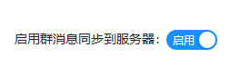

### 要将消息同步到哪些服务器?

该服务器的消息会同步到你指定的作用服务器

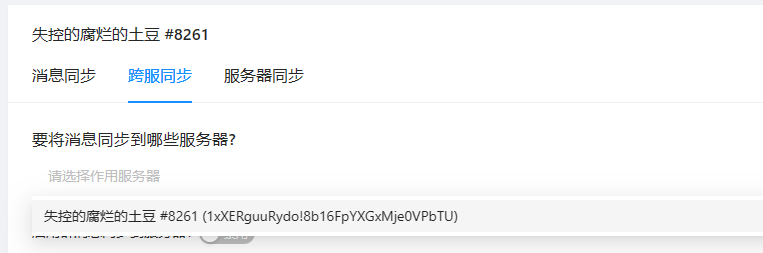

请不要尝试把本服务器设置到作用服务器内,不然你在保存时会得到一个错误

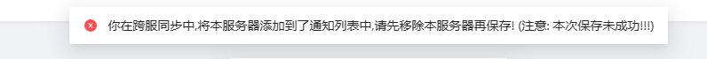

### 同步到其他服务器消息模板

嗯 看着配置就行

此处的模板指的是 A 服务器的事件 同步到其他服务器时 应该显示怎样的消息

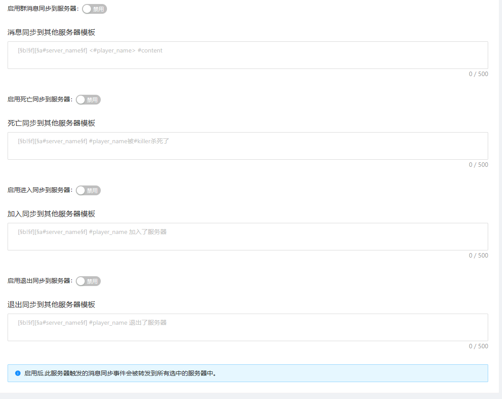

#### 模板的可用参数
> [!IMPORTANT]
> 在模板框中输入符号"#"来显示可用参数(添加的时候必须有"#"号)
> 小提示:image(图片地址)如果要使用本地文件，请填写此文件的绝对路径比如"C:\Users\MiuxuE\Pictures\uiltx15is5c.jpg

##### 消息同步到其他服务器模板

> 1.#player\_name显示发送玩家的名称

> 2.#player\_name\_raw显示发送玩家的名称(元数据) 和#player\_name没啥区别

> 3.#player\_uuid显示发送玩家的uuid

> 4.#server\_name玩家发送时所在的服务器名称

> 5.#content发送的信息

##### 死亡同步到其他服务器模板

> 1.#player\_name显示发送玩家的名称

> 2.#player\_name\_raw显示发送玩家的名称(元数据) 和#player\_name没啥区别

> 3.#player\_uuid显示发送玩家的uuid

> 4.#server\_name玩家发送时所在的服务器名称

> 5.#raw显示死亡的原始信息

> 6.#killer显示杀手

##### 加入同步其他服务器模板和退出同步到其他服务器模板
> 1.#player\_name显示发送玩家的名称

> 2.#player\_name\_raw显示发送玩家的名称(元数据) 和#player\_name没啥区别

> 3.#player\_uuid显示发送玩家的uuid

> 4.#server\_name玩家发送时所在的服务器名称

## 服务器同步

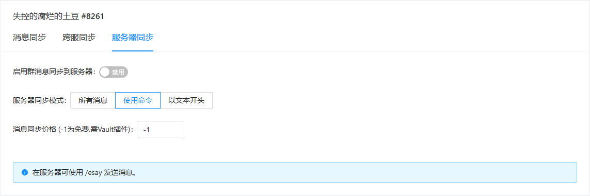

### 启用群消息同步到服务器

开启跨服同步,与跨服同步页面的开关是同一个东西

### 服务器同步模式

> 所有消息: 玩家在服务器发送的所有消息都会被同步
> 使用命令: 玩家可以在服务器使用 /esay 要说的话 来同步消息
> 以文本开头: 玩家在公屏的消息必须以文本设定的文本开头才会同步

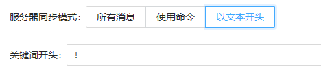

##### 同步对象

可以是群 可以是其他服务器 如果两者你都设置了 那么将会同时同步本次消息

### 信息同步问题

此功能仅进行了简单测试,如果有BUG请反馈

