# 绑定账号
绑定账号属于EasyBot的核心功能, 玩家使用其他功能都必须要绑定一个账号

### 术语

社交平台 QQ 微信 Telegram Kook 等软件...

服务器 Minecraft服务器

软件 EasyBot主程序

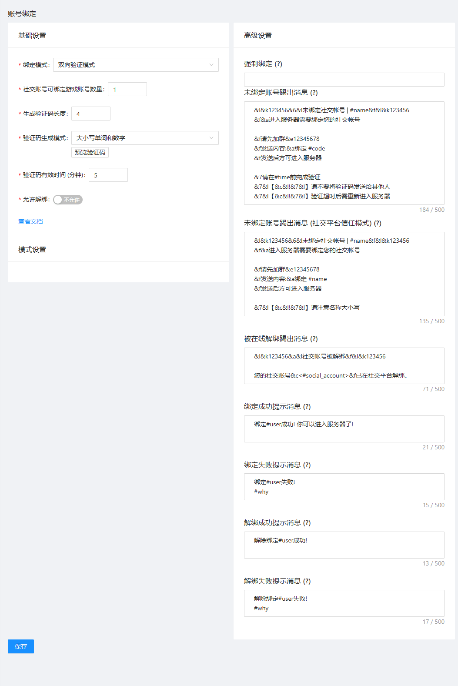

---

## 绑定模式

EasyBot提供了丰富的绑定模式

---

### 双向验证模式

双向验证模式: 即用户必须在服务器和社交平台完成验证才可绑定

#### 触发

1. 用户在服务器内输入`/easybot bind`获取验证码

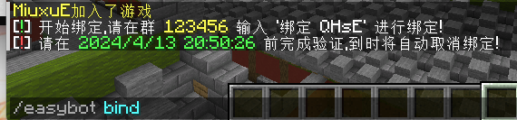

2. 用户可以在QQ群触发绑定,即: 输入`绑定 + 验证码`完成绑定

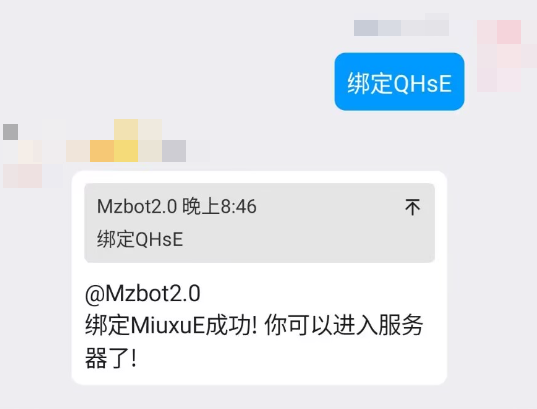

---

### 社交平台信任模式

玩家直接在社交平台输入用户名就可以完成绑定

#### 触发

* 用户在社交平台内输入`绑定+Id`即可

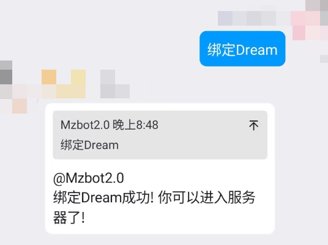

---

# 强制绑定

强制绑定是高级绑定中的功能,顾名思义,在强制绑定列表中的服务器不允许没有绑定账号的玩家进入服务器

你可以在高级设置里找到并且设置强制绑定的服务器

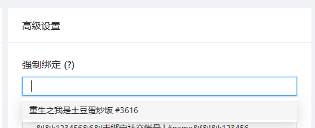

# 强制绑定如何绑定?

玩家进入强制要求绑定的服务器时,会自动生成验证码并提示玩家绑定

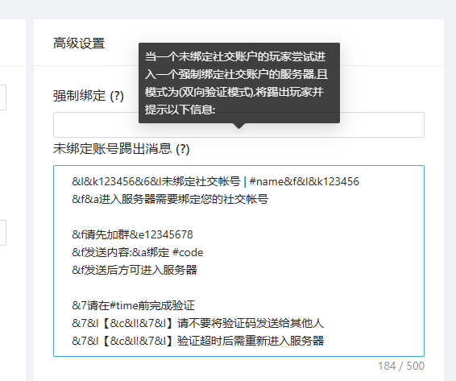

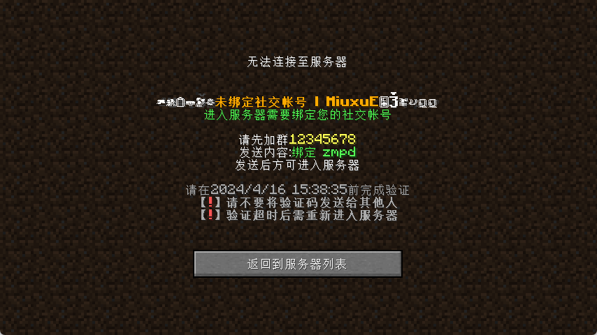

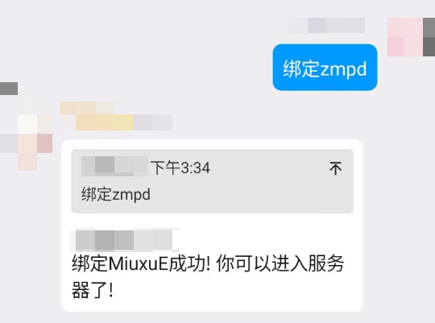

## 被在线解绑踢出

当被在线解绑后会给所有服务器广播解绑消息,如果一个玩家在强制要求绑定账号的服务器中,会被踢出服务器并显示以下消息。

### 被在线解绑踢出消息在 0.1.1版本 默认显示有点问题

忘记在第二行加入&f导致"您的社交账号"这几个字也是乱码, 嗯 自行修复 在第二行开始加入 &f就行 (见下图)

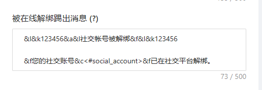

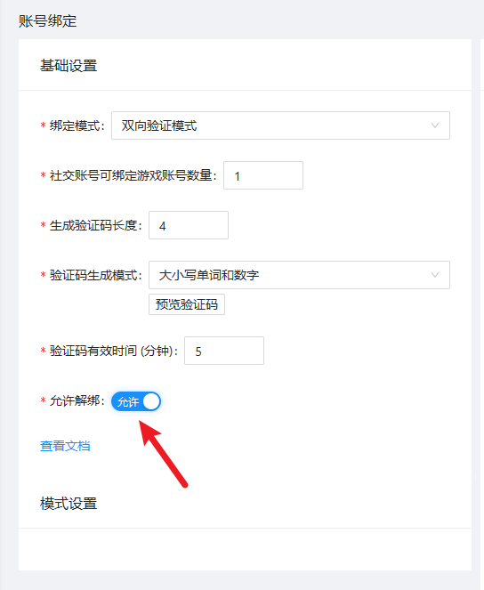

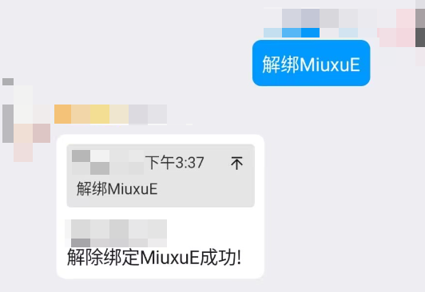

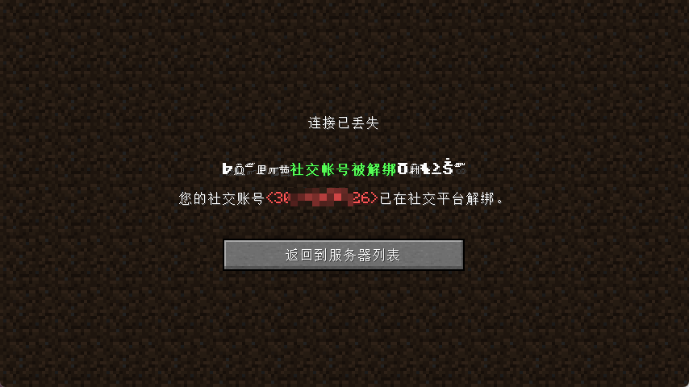