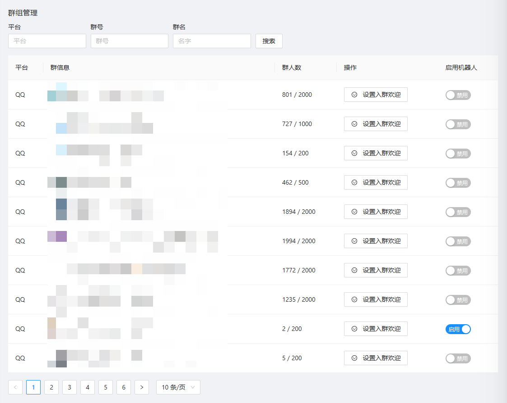
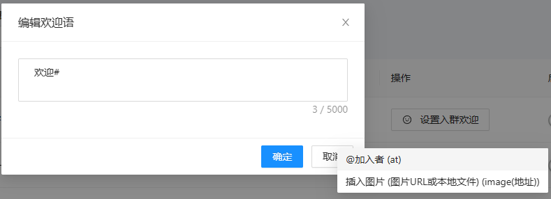
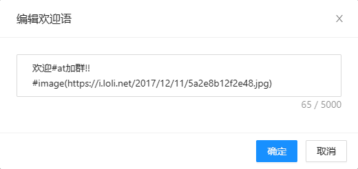
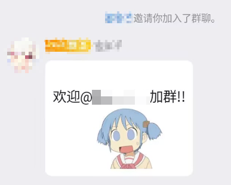

群组管理,顾名思义! 相信大家都会用的!

如果你发现你的群组管理页面是空的,啥也没有 请看: [教程: 获取并启用群聊](quick_start/enable_group)

---

## 关联文档
机器人支持在用户加群后主动发送消息
我们支持自定义加群消息,您可以在消息中插入图片,或是@加入者

> [!IMPORTANT]
> 使用 "#" 触发变量提示

> [!TIP]
> 可用参数(必须在参数前面加上"#")
> #at (@加入者)
> #image(图片地址) (插入图片,地址所指的是这张图片的在线url或本地文件)

> [!IMPORTANT]
> 小提示:image(图片地址)如果要使用本地文件，请填写此文件的绝对路径比如"C:\Users\MiuxuE\Pictures\uiltx15is5c.jpg

### 演示

编辑好后保存

