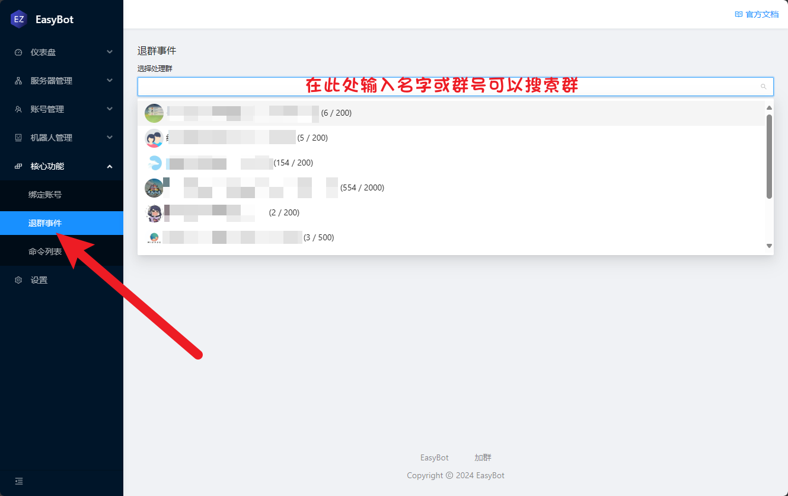
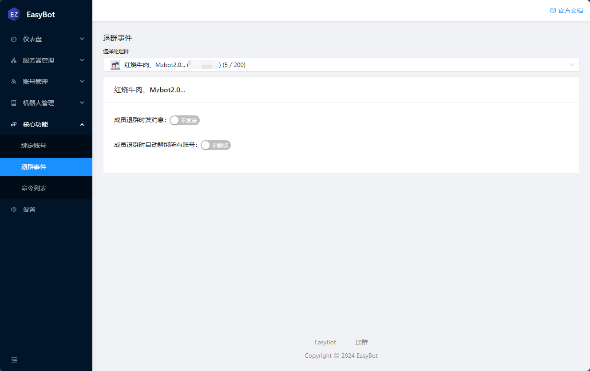
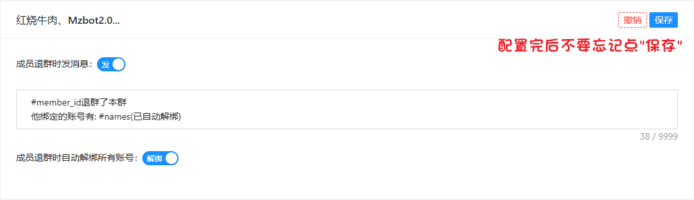
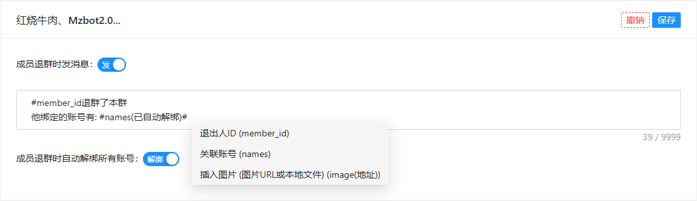

# 退群自动解绑和退群消息

此功能需要安装 0.1.3 以上的版本

> [!IMPORTANT]此功能需要启动群聊才会响应事件

# 关联功能

[安装指南](/绑定账号)

在核心功能 -> 退群事件 处选择一个群聊

# 开启功能

小贴士: 占位符都有哪些在退群消息编辑框中，输入#可以查看都有哪些占位符

点击保存后，有人退出就会发送对应消息，并且自动解绑

如果只勾选"成员退群时自动解绑所有账号"， "成员退群时发消息"处于禁用状态， 那你懂的， 悄悄解绑。🤫🤫

如果退群者未绑定任何账号，"#names"占位符会变成"无"
